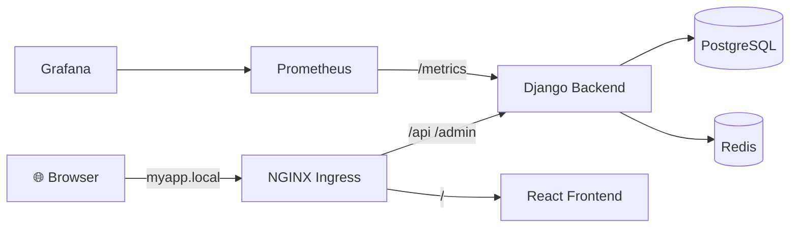

# 🏢 Multi-Tenant SaaS Platform

**One application. Many organizations. Fully isolated data.**


---

## 📖 About

A production-oriented multi-tenant SaaS platform designed to allow multiple organizations to use the same application while keeping their users, projects, and data securely isolated from one another.

The platform provides organization management, user roles and permissions, project and task management, authentication, and a scalable backend architecture.

The project is also built as a real-world DevOps project, covering the complete application lifecycle — from development and containerization to automated CI/CD, Kubernetes deployment, cloud infrastructure, infrastructure as code, monitoring, logging, and security.

## 🎯 Key Areas

- 🔒 Multi-tenant architecture and data isolation
- 👥 User authentication and role-based access control
- 📋 Project and task management
- 🐘 PostgreSQL database
- ⚡ Redis caching
- 🐳 Docker containerization
- 🔁 CI/CD with GitHub Actions
- ☸️ Kubernetes orchestration
- ☁️ AWS cloud deployment
- 📈 Monitoring with Prometheus and Grafana


> The goal of this project is to simulate how a production SaaS application is developed, deployed, monitored, secured, and maintained in a real-world DevOps environment.

## 🧱 Architecture



## 📁 Folder structure

```
pulse-saas-platform/
├── .github/workflows/    # CI/CD
├── backend/              # Django API (apps/, config/, requirements/, Dockerfile)
├── frontend/             # React app (src/)
├── k8s/                  # Kubernetes manifests (ingress.yaml, monitoring.yaml, ...)
├── monitoring/           # Prometheus config + Grafana dashboard
├── docker-compose.yml
├── DEPLOYMENT.md
└── README.md
```

## 💻 Run locally

```bash
# backend (needs PostgreSQL)
cd backend
python -m venv venv && venv\Scripts\activate
pip install -r requirements/development.txt
cp .env.example .env
python manage.py migrate
python manage.py seed_data
python manage.py runserver        # http://localhost:8000/api/

# frontend
cd frontend
npm install
npm run dev                       # http://localhost:5173
```

## ☸️ Run on minikube (ingress)

**1. Start the cluster and deploy**

```powershell
minikube start
minikube addons enable ingress
kubectl apply -f k8s/
```

**2. Add the host name** (PowerShell **as Administrator**, once)

```powershell
Add-Content -Path "$env:SystemRoot\System32\drivers\etc\hosts" -Value "127.0.0.1 myapp.local"
```

**3. Start the tunnel** (separate terminal, keep it open)

```powershell
minikube tunnel
```

**4. Open the app in your browser** 🎉

| 🔗 URL | What |
|---|---|
| http://myapp.local/ | 🖥️ App |
| http://myapp.local/api/docs/ | 📘 API docs (Swagger) |
| http://myapp.local/admin/ | ⚙️ Django admin |

> [!IMPORTANT]
> Required settings:
> - Backend `ALLOWED_HOSTS` must include `myapp.local` and `backend-service`
> - Frontend `VITE_API_URL=/api` (set before building the frontend image)
> - `k8s/ingress.yaml` must use `host: myapp.local`

**5. Create the demo data inside the cluster**

```powershell
kubectl exec deploy/backend -n app-namespace -- python manage.py migrate
kubectl exec deploy/backend -n app-namespace -- python manage.py seed_data
```

## 📈 Monitoring

```powershell
kubectl port-forward -n app-namespace svc/monitoring-service 9090:9090
kubectl port-forward -n app-namespace svc/grafana-service 3000:3000
```

| Tool | URL | Notes |
|---|---|---|
| 🔥 Prometheus | http://localhost:9090 | Status → Target health, all UP |
| 📊 Grafana | http://localhost:3000 | Login `admin` / `admin`. Add data source `http://monitoring-service:9090`, then import `monitoring/pulse-dashboard.json` |

## 👤 Demo accounts

Created by `python manage.py seed_data`.

> 🔑 **Password for every account: `DemoPass123!`**

There are two separate organizations. Each has 1 owner, 1 admin, 3 members, 3 projects and several tasks.

### 🅰️ Organization A

| Email | Role | What this user can do |
|---|---|---|
| `owner-a@demo.test` | 👑 Owner | Everything in Org A: manage projects, tasks and members, change admin roles, delete the organization |
| `admin-a@demo.test` | 🛡️ Admin | Manage projects, tasks and members in Org A (cannot delete the organization or change admin roles) |
| `member-a-1@demo.test` | 👤 Member | View everything in Org A; update the status of tasks assigned to them |
| `member-a-2@demo.test` | 👤 Member | Same as above |
| `member-a-3@demo.test` | 👤 Member | Same as above |

### 🅱️ Organization B

| Email | Role | What this user can do |
|---|---|---|
| `owner-b@demo.test` | 👑 Owner | Everything in Org B: manage projects, tasks and members, change admin roles, delete the organization |
| `admin-b@demo.test` | 🛡️ Admin | Manage projects, tasks and members in Org B (cannot delete the organization or change admin roles) |
| `member-b-1@demo.test` | 👤 Member | View everything in Org B; update the status of tasks assigned to them |
| `member-b-2@demo.test` | 👤 Member | Same as above |
| `member-b-3@demo.test` | 👤 Member | Same as above |

Members cannot create or delete projects, delete tasks, or manage members.

### 🧪 Try the tenant isolation

1. Log in as `owner-a@demo.test` and note the projects you see (Org A only).
2. Log out, log in as `owner-b@demo.test`: you see a completely different set of projects (Org B only).
3. Org A users can never see or reach Org B's projects, tasks or members, not even by guessing IDs. The backend returns 403/404.

## 🛠️ Troubleshooting

| Problem | Fix |
|---|---|
| `myapp.local` not found | Add the hosts entry (Administrator PowerShell) |
| Page times out | Start `minikube tunnel` and keep it running |
| nginx 404 / 502 / 503 | `kubectl get ingress,endpoints -n app-namespace` and `kubectl logs deploy/backend -n app-namespace` |
| UI calls `localhost:8000` | Rebuild the frontend image with `VITE_API_URL=/api` |
| API 400 Bad Request | Add `myapp.local` to `ALLOWED_HOSTS` |
| `ErrImagePull` | Build with `minikube image build` and use `imagePullPolicy: IfNotPresent` |